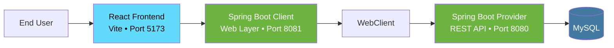

# 🚀 Product Catalog Enterprise Dashboard

A full-stack mini enterprise application built using a modern microservice-inspired architecture.

This project demonstrates how multiple applications communicate with each other in a real-world enterprise environment.

## 🏗️ System Architecture


---

## 📌 Project Overview

This application manages a product catalog and demonstrates:

- Multi-application architecture
- Service-to-service communication
- REST API development
- Spring Boot WebClient
- MySQL integration
- React dashboard development
- Enterprise-level backend concepts

---

# 🛠️ Tech Stack

## Frontend

- React
- Vite
- Tailwind CSS
- Axios
- Lucide React

## Backend

### Provider Application (8080)

- Spring Boot
- Spring Data JPA
- MySQL
- Swagger
- Actuator
- Global Exception Handling

### Client Application (8081)

- Spring Boot
- WebClient
- Swagger
- Actuator
- Global Exception Handling

## Database

- MySQL

## Tools

- Git
- GitHub
- Apidog

---

# 📂 Project Structure

```text
SpringBoot-React-Client-Provider/

├── product-provider
│
│   ├── controller
│   ├── service
│   ├── repository
│   ├── entity
│   ├── advice
│   └── ProductProviderApplication.java
│
├── product-client
│
│   ├── controller
│   ├── service
│   ├── dto
│   ├── config
│   ├── exception
│   └── ProductClientApplication.java
│
└── product-frontend
    │
    ├── components
    ├── services
    ├── App.jsx
    └── main.jsx
```

---

# ✨ Features

## Provider Application

- ✅ Create Product
- ✅ Get All Products
- ✅ Get Product By ID
- ✅ Update Product
- ✅ Delete Product
- ✅ ResponseEntity
- ✅ Global Exception Handling
- ✅ Swagger Documentation
- ✅ Spring Boot Actuator

---

## Client Application

- ✅ Service-to-Service Communication
- ✅ WebClient Integration
- ✅ Exception Handling
- ✅ Swagger Documentation
- ✅ Spring Boot Actuator
- ✅ Provider Failure Handling

---

## Frontend Dashboard

- ✅ Product Dashboard
- ✅ Search Products
- ✅ Refresh Products
- ✅ Statistics Cards
- ✅ Responsive UI
- ✅ Glassmorphism Design
- ✅ Dark Theme

---

# ⚙️ Setup Instructions

## 1️⃣ Clone Repository

```bash
git clone <repository-url>

cd SpringBoot-React-Client-Provider
```

---

## 2️⃣ Start MySQL

Create database:

```sql
CREATE DATABASE productdb;
```

Update `application.properties`:

```properties
spring.datasource.url=jdbc:mysql://localhost:3306/productdb

spring.datasource.username=your_username

spring.datasource.password=your_password
```

---

## 3️⃣ Run Provider Application

Navigate to:

```text
product-provider
```

Run:

```bash
mvn spring-boot:run
```

Runs on:

```text
http://localhost:8080
```

Swagger:

```text
http://localhost:8080/swagger-ui/index.html
```

Actuator:

```text
http://localhost:8080/actuator
```

---

## 4️⃣ Run Client Application

Navigate to:

```text
product-client
```

Run:

```bash
mvn spring-boot:run
```

Runs on:

```text
http://localhost:8081
```

Swagger:

```text
http://localhost:8081/swagger-ui/index.html
```

Actuator:

```text
http://localhost:8081/actuator
```

---

## 5️⃣ Run React Application

Navigate to:

```text
product-frontend
```

Install dependencies:

```bash
npm install
```

Run:

```bash
npm run dev
```

Runs on:

```text
http://localhost:5173
```

---

# 📡 API Endpoints

## Provider

### Get All Products

```http
GET /products
```

### Get Product By Id

```http
GET /products/{id}
```

### Add Product

```http
POST /products
```

### Update Product

```http
PUT /products/{id}
```

### Delete Product

```http
DELETE /products/{id}
```

---

# 🧠 Concepts Practiced

- Spring Boot Architecture
- Dependency Injection
- REST APIs
- ResponseEntity
- Global Exception Handling
- Spring Data JPA
- WebClient
- Service-to-Service Communication
- Swagger
- Actuator
- React Hooks
- Axios
- Tailwind CSS
- CORS
- Git & GitHub

---

# 🎯 Learning Outcome

This project was built to understand how enterprise applications communicate internally and how a full-stack architecture is designed using modern technologies.

---

# 🚀 Future Enhancements

- 🔐 Authentication & Authorization (JWT)
- 📊 Analytics Dashboard
- 🖼️ Product Images
- 📄 Pagination
- 🔔 Toast Notifications
- 🌙 Dark/Light Theme
- 🐳 Dockerization
- ☁️ Cloud Deployment (AWS)

---

# 👨‍💻 Author

**Yash Mulay**

B.Tech Information Technology | Walchand College of Engineering, Sangli

GitHub: https://github.com/yashmmulay

LinkedIn: https://www.linkedin.com/in/yash-mulay-6377b9244/

---

⭐ If you found this project useful, consider giving it a star.
